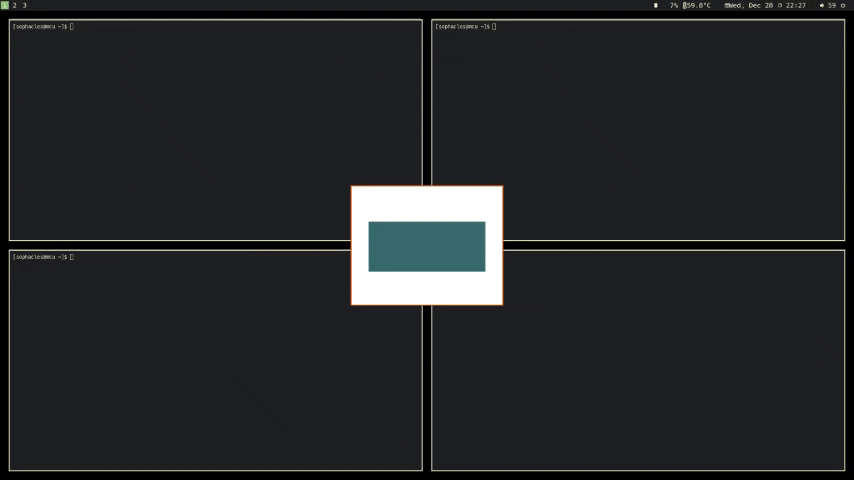
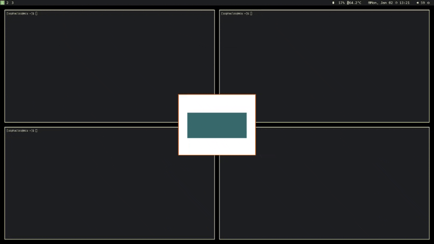
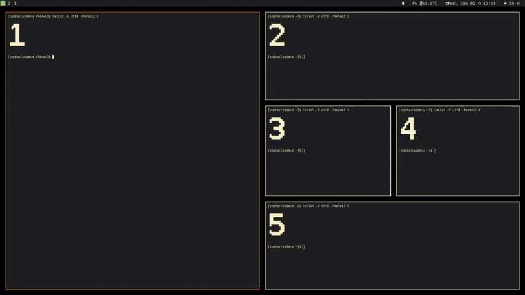

# i3-valet

A collection of tools for i3 that assist in window, workspace and output
operations. `i3-valet` can be run directly from the command line or as an i3
sidekick that listens for keybinding events over ipc.

## Building & Installation

`i3-valet` is written in Rust and has only been tested against the latest
stable version. It can be build with `cargo build --release` and the binary can
be placed somehere in `$PATH`.

(note: this is still a newly public tool, if there's interest I'm glad to work
with folks on better distribution)

## Using i3-valet

`i3-valet` operates by running commands (called Actions). These actions will
connect to i3-ipc and query information and then send commands back to i3.
Whether run via keybinding in `listen` mode or from the cli, the actions have
consistent names and arguments so you can test out what an action will do
without having to muck with your i3config.

The available actions are:
```
  fix        clean up the window tree
  loc        Move A floating window to anchor point
  print      Print information about the current tree or window
  workspace  Workspace commands
  output     Movement between relative outputs
  layout     Window layout helpers
```

Information about actions and arguments can be found via the help subcommand, e.g.:

```
$ i3-valet help run output
Movement between relative outputs.

This assumes outputs are linear and cycles through them in order

Usage: i3-valet run output <CHANGE> <DIR>

Arguments:
  <CHANGE>
          Possible values:
          - move-ws:  move workspace to a different output
          - move-win: move workspace to a different output
          - focus:    focus a different output

  <DIR>
          [possible values: next, prev]

Options:
  -h, --help
          Print help information (use `-h` for a summary)
```

### CLI 

To run an action from the command line simply use `i3-valet run
<ACTION>`. For example to focus the next output:

```
$ i3-valet run output focus next
```

### Listen

Listen mode can be entered by running `i3-valet listen`. In this mode the
program will connect to i3 and subscribe to keybind events. When an event for
an i3-valet action arrives, it will do that action.  Listen mode will exit the
program if the connection to i3 is closed so it's recommended to run it from
i3-config like this:

```
exec_always --no-startup-id i3-valet listen
```

So that if i3 is restarted `i3-valet` will also restart.

To configure keybindings use the `nop` command followed by an action just like
the action on a command line. For example to configure a mode for moving floats
using the `loc` action:

```
mode "move" {
    bindsym u     nop loc rel nw
    bindsym i     nop loc rel top
    bindsym o     nop loc rel ne
    bindsym n     nop loc rel sw
    bindsym m     nop loc rel bot
    bindsym comma nop loc rel se
}
bindsym $mod+m mode "move"
```
**How it works**
The listen functionality takes advantage of the `nop` command in the i3 config
- this command tells i3 that anything after the `nop` is to be ignored. When i3
creates events for pressed keybinding, it puts the entire command into the
event anyway.

For example this binding in i3config:
```
bindsym $mod+t nop foo bar
```
will report `nop foo bar` as the command when `$mod+t` is pressed.

i3-valet just strips the `nop` from the command and parses it like it would
from the command line.


## Actions

### Loc
Move  floating windows to anchor points on the screen.

The first argument, `abs` or `rel` describes how the anchor coordiantes are calculated.

* `abs` is relative to the display, and will cover the bar with the floating window.
* `rel` is relative to the content area of the display, "inside" the bars.

This i3config is used in the demo below.
```
mode "move" {
    # Move floating containers
    bindsym $mod+u     nop loc rel nw
    bindsym $mod+i     nop loc rel top
    bindsym $mod+o     nop loc rel ne
    bindsym $mod+l     nop loc rel right
    bindsym $mod+n     nop loc rel sw
    bindsym $mod+m     nop loc rel bot
    bindsym $mod+j     nop loc rel left
    bindsym $mod+comma nop loc rel se
    bindsym $mod+k     move position center

    bindsym space  mode "default"
}

bindsym $mod+m mode "move"

exec_always --no-startup-id i3-valet listen 
```



Replacing the `loc` with `abs` in the action, e.g.:

```
    bindsym $mod+u     nop loc abs nw
```

will move the floating window over the bar.



### Layout

Actions that help build or maintain a window layout and movement within that.

**Main** Actions pertaining to a "main" window position in a layout.

* `layout main set` designates the currently focusted window as being in the "main" position. 
* `layout main focus` focuses the window in the main position
* `layout main swap` swap the current window with the window in the main
  position. If the currently focused window is in the main position, it will be
  swapped with the most recently focused window in the workspace.


In the demo below, this is the relevant i3 config:
```
bindsym $mod+Shift+i nop layout main set
bindsym $mod+i nop layout main focus
bindsym $mod+Tab nop layout main swap
```



### Output

i3 output targets are based on the output name. When one wants to share a
single config amongst several machines, or uses a laptop that may be connected
to several outputs in a day (particularly using various connector types) it can
be difficult to set up keybindings consistently. The `i3-valet` output actions
solve this by examining the currently connected outputs and treating them
linearly.

The commands all take an argument, either `next` or `prev` as a target output
(on a 2 display setup, these are the same). The available actions are:

* `focus TARGET` - focus the target output
* `move-win TARGET` - move the currently focused window to the target output
* `move-ws TARGET` - move the current workspace to the target output

### Workspace

Focus the next empty workspace. i3 expects an explicit workspace name (or
number) in commands. Sometimes that isn't desired, but rather "any empty"
workspace is desired. The `workspace` actions will find the lowest number
workspace that currently contains no windows, and focus or move a container to that workspace.

For example, if worspaces 1 and 2 have windows, the action `workspace alloc`
will focus workspace 3. If 1, 3, and 4 have windows, then the same command will
focus workspace 2.

The available actions are:

* `alloc` - focus the next available workspace
* `move-new` - move the currently focused container to the next available workspace

## Contributing

Contributions welome! Just open a PR or Issue and we can hash it out.

Areas where some help would be greatly appreciated:

* Testing and fixing for sway
* Doc improvements
* New actions
